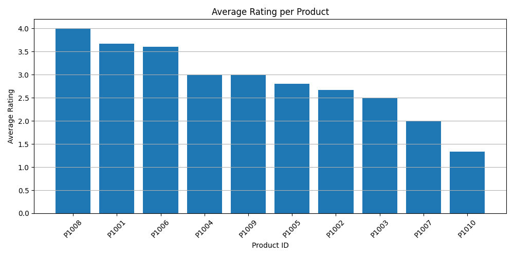

# MongoDB Product Review Analysis

This project demonstrates a complete data pipeline for storing, querying, and analyzing product review data using MongoDB and Python. It includes:

- Data ingestion (JSON files)
- MongoDB document storage
- Keyword-based review search
- Aggregation queries to calculate average product ratings
- Visualization with matplotlib
- CSV export for further analysis or Power BI

---

## Project Structure

```
mongodb-product-review/
├── data/
│   ├── sample_products.json        
│   ├── sample_reviews.json          
│   ├── average_ratings.csv         
│   └── avg_rating_chart.png        
│
├── scripts/
│   ├── insert_data.py               
│   ├── query_keywords.py           
│   └── query_examples.py           
│
├── .env                             
└── README.md
```

---

## How to Run

### 1. Install dependencies

```bash
pip install pymongo python-dotenv pandas matplotlib
```

### 2. Set up MongoDB connection

Create a `.env` file in the project root with:

```
MONGODB_USER=your_username
MONGODB_PASSWORD=your_password
MONGODB_CLUSTER=your_cluster_url
```

> Do not upload `.env` to GitHub.

### 3. Insert sample data

```bash
python scripts/insert_data.py
```

### 4. Run analysis & visualization

```bash
python scripts/query_examples.py
```

### 5. Search by keyword + rating

```bash
python scripts/query_keywords.py
```

---

## Sample Output



---

## Technologies Used

- **MongoDB Atlas** – cloud NoSQL database
- **Python 3**
- **Pandas** & **Matplotlib** – data analysis & visualization
- **dotenv** – environment variable handling
- **VSCode** – IDE used

---

## Use Cases

- Detect low-rated comments mentioning keywords (e.g. “good”)
- Monitor product performance
- Quickly generate insights from text reviews

---

## Author

This project was created for educational and portfolio purposes to demonstrate real-world MongoDB and Python data analysis workflows.

---